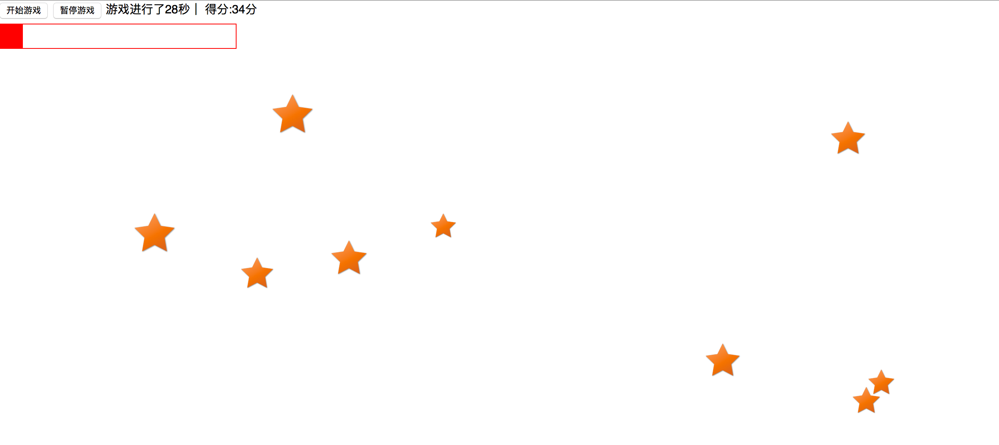

layout: post
title: 消消乐小游戏
date: 2015-07-20 23:40:01
categories:   # 文章分类目录，参数可省略
- 代码
tags: 
- 游戏
- JavaScript
---
# 消消乐小游戏

------

使用HTML+CSS+JavaScript编写的简易消消乐小游戏！随着时间的推移会越来越快的出现随机位置随机大小的小星星，点击小小星星就会消失。
游戏功能如下：

> * 开始游戏
> * 暂停游戏
> * 结束游戏
> * 游戏时常记录
> * 游戏分数统计，记录消掉星星的个数
> * 游戏血条显示，设定结束关卡为10个星星

<!-- more -->



------

## 技术点备注

> 消除星星时通过obj.onclick=remove;
再通过remove()函数：this.parentNode.removeChild(this);进行消除

------

## 代码如下


```JavaScript
<!DOCTYPE html>
<html lang="zh-cn">
<head>
	<meta charset="UTF-8">
	<style type="text/css">
		*{
			margin: 0px;
			padding: 0px;
		}
		#blood{
			margin-top:5px;
			width: 300px;
			height: 30px;
			border: 1px solid red;
			display:block;
		}
		#blood2{
			display: inline-block;
			width:300px;
			height: 30px;
			background: red;
		}
	</style>
	<script type="text/javascript">
	var time,time2,time3;
	var count=0;
	var score = 0;
	var i=1000;
	var n=0;
		//启动定时器
		function start(){
			window.clearInterval(time);
			if(i>100){i-=100;}
			//设定当页面出现的星星超过10个就结束游戏
			time = window.setInterval('show()',i);
		}
			//加快速度
			function speed(){
			window.clearInterval(time2);
			window.clearInterval(time3);
			//显示游戏进行的时间
			time3 = window.setInterval("timeOver()",1000);
			//点击开始默认先加载一次
			window.setTimeout("start()",0);
			time2 = window.setInterval("start()",5000);
		}
		//开始显示星星
		function show(){
			//创建对象
			var obj = document.createElement('img');
			//设置对象属性
			//生成随机大小的星星
			var size = Math.floor(Math.random()*30+30);
			//生成随机的位置坐标,首先获取屏幕尺寸的大小
			var h = parseInt(screen.availHeight);
			var w = parseInt(screen.availWidth);
			var x = Math.floor(Math.random()*(w-w*0.2)+w*0.1);
			var y = Math.floor(Math.random()*(h-h*0.4)+h*0.1);
			//通过src设置图片路径
			obj.src="images/xingxing.png";
			obj.width = size;
			//必须通过定位才能使用top和left功能
			obj.style.position = "absolute";
			obj.style.top = y + "px";
			obj.style.left = x+ "px";
			//写入内容到页面中
			document.body.appendChild(obj);
			//记录写入到页面的次数
			count++;
			//设置血条的长度
			var obj4 = document.getElementById("blood2");
			obj4.style.width = 300-(count * 30) +"px";
			//设定超过次数就结束游戏
			if (count>=10){
				alert("游戏结束，得分"+score+"分");
				window.clearInterval(time);
				window.clearInterval(time2);
				window.clearInterval(time3);
				//游戏结束，清楚所有星星通过重新加载页面
				location.reload();
			}
			//添加点击事件用来消除星星
			obj.onclick=remove;
		}
		//消除星星
		function remove(){
			this.parentNode.removeChild(this);
			//记录消除的次数
			count--;
			//计算总分数
			score++;
			var obj5=document.getElementById("score");
			obj5.innerHTML="得分:"+score+"分";
		}
		//显示游戏进行的时间
		function timeOver(){
			n++;
			var obj3 = document.getElementById("overTime");
			obj3.innerHTML="游戏进行了"+n+"秒";
		}
		//暂停游戏
		function pause(){
			alert("暂停游戏");
		}
	</script>
	<title>星星小游戏</title>
</head>
<body>
<input type="button" value="开始游戏" onclick="speed()"></input>
<input type="button" value="暂停游戏" onclick="pause()"></input>
<span id="overTime">游戏进行了0秒</span>｜
<span id="score">得分:0分</span>
<span id="blood"><span id="blood2"></span></span>
</body>
</html>
```

