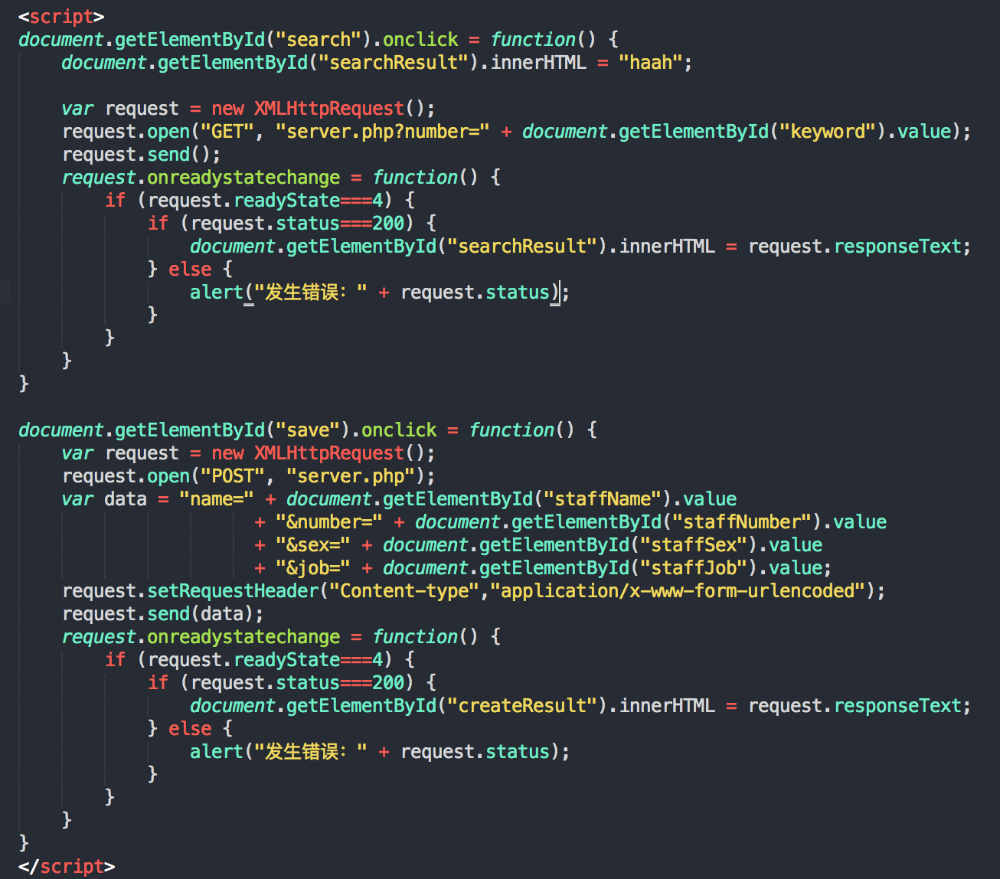

layout: post
title: 异步的JavaScript和XML
date: 2015-10-05 22:07:14
tags:
- AJAX
---
# 概念介绍
AJAX的全称
Asynchronous JavaScript and XML
异步的JavaScript和XML

作用：在无需重新加载整个网页的情况下，能够更新部分网页的技术
通过少量数据交换，实现异部局部更新

应用：社交软件，地图

操作步骤：
1、利用html+css来实现页面，表达信息；
2、用XMLHttpRequest和web服务器进行数据的异步交换
3、运营js操作DOM，实现动态局部刷新；

XMLHttpRequest对象的出现分割了同步和异步。XMLHttpRequest出现之前是同步的，出现之后是异步的。
同步：页面请求实时传给服务器，导致必填数据没有填的时候，要回到页面上重新从头填写，耗时长、客户体验差。
异步：在页面必填项写上必填选项，不用通过传给服务器判断必填内容是否已经填写完整，耗时短、用户体验强。

# HTTP请求
一个完整地HTTP请求过程，通常有7个步骤
1.建立TCP连接
2.Web浏览器向Web服务器发送请求命令
3.Web浏览器发送请求头信息
4.Web服务器应答
5.Web服务器发送应答头信息
6.Web服务器向浏览器发送数据
7.Web服务器关闭TCP连接

一个HTTP请求一般由四部分组成
1.HTTP请求的方法或动作，比如是GET还是POST请求
2.正在请求的URL，总得知道请求的地址是什么吧
3.请求头，包含一些客户端环境信息，身份验证信息等
4.请求体，也就是请求正文，请求正文中可以包含客户提交的查询字符串信息，表单信息等等

一个HTTP响应一般由三部分组成
1.一个数字和文字组成的状态码，用来显示请求是成功还是失败
2.响应头，响应头也和请求头一样包含许多有用的信息，例如服务器类型、日期时间、内容类型和长度等
3.响应体，也就是响应正文

GET：
+ 一般用于信息获取
+ 使用URL传递参数
+ 对所发送信息的数量也有限制，一般在2000个字符

POST：
+ 一般用于修改服务器上的资源
+ 对所发送信息的数量无限制


# HTTP状态码
HTTP状态码由3位数字构成，其中首位数字定义了状态码的类型：
1XX：信息类，表示收到Web浏览器请求，正在进一步的处理中。
2XX：成功，表示用户请求被正确接收，理解和处理，例如：200 OK
3XX：重定向，表示请求没有成功，客户必须采取进一步的动作
4XX：客户端错误，表示客户端提交的请求有错误，例如：400 NOT FOUND 意味着请求中所引起的文档不存在
5XX：服务器错误，表示服务器不能完成对请求的处理：如500

# XMLHttpRequest发送请求
var request = new XMLHttpRequset();
`open(method,url,async)`
`send(string)`

GET 发送请求

```
request.open('GET','get.php?id=55',true);
request.send();
```

POST 发送请求

```
request.open("POST","create.php",true);
request.setRequestHeader("Content-type","application/x-www-form-urlencoded");
request.send("name=uiste&sex=man");
```

# XMLHttpRequset取得响应
responseText：获得字符串形式的响应数据
responseXML： 获得XML形式的响应数据
status和statusText：以数字和文本形式返回HTTP状态码
getAllResponseHeader()：获取所有的响应报头
getResponseHeader()：查询响应中的某个字段的值

# readyState属性
0：请求未初始化，open还没有调用
1：服务器连接已建立，open已经调用了
2：请求已接收，也就是接收到头信息了
3：请求处理中，也就是接收到响应主体了
4：请求已完成，且响应已就绪，也就是响应完成了

# 源码案例


---
## json

```javascript
<script>
document.getElementById("search").onclick = function() { 
	var request = new XMLHttpRequest();
	request.open("GET", "serverjson.php?number=" + document.getElementById("keyword").value);
	request.send();
	request.onreadystatechange = function() {
		if (request.readyState===4) {
			if (request.status===200) { 
				var data = JSON.parse(request.responseText);
				if (data.success) { 
					document.getElementById("searchResult").innerHTML = data.msg;
				} else {
					document.getElementById("searchResult").innerHTML = "出现错误：" + data.msg;
				}
			} else {
				alert("发生错误：" + request.status);
			}
		} 
	}
}

document.getElementById("save").onclick = function() { 
	var request = new XMLHttpRequest();
	request.open("POST", "serverjson.php");
	var data = "name=" + document.getElementById("staffName").value 
	                  + "&number=" + document.getElementById("staffNumber").value 
	                  + "&sex=" + document.getElementById("staffSex").value 
	                  + "&job=" + document.getElementById("staffJob").value;
	request.setRequestHeader("Content-type","application/x-www-form-urlencoded");
	request.send(data);
	request.onreadystatechange = function() {
		if (request.readyState===4) {
			if (request.status===200) { 
				var data = JSON.parse(request.responseText);
				if (data.success) { 
					document.getElementById("createResult").innerHTML = data.msg;
				} else {
					document.getElementById("createResult").innerHTML = "出现错误：" + data.msg;
				}
			} else {
				alert("发生错误：" + request.status);
			}
		} 
	}
}
</script>
```

```php
<?php
//设置页面内容是html编码格式是utf-8
header("Content-Type: text/plain;charset=utf-8"); 
//header("Content-Type: application/json;charset=utf-8"); 
//header("Content-Type: text/xml;charset=utf-8"); 
//header("Content-Type: text/html;charset=utf-8"); 
//header("Content-Type: application/javascript;charset=utf-8"); 

//定义一个多维数组，包含员工的信息，每条员工信息为一个数组
$staff = array
	(
		array("name" => "洪七", "number" => "101", "sex" => "男", "job" => "总经理"),
		array("name" => "郭靖", "number" => "102", "sex" => "男", "job" => "开发工程师"),
		array("name" => "黄蓉", "number" => "103", "sex" => "女", "job" => "产品经理")
	);

//判断如果是get请求，则进行搜索；如果是POST请求，则进行新建
//$_SERVER是一个超全局变量，在一个脚本的全部作用域中都可用，不用使用global关键字
//$_SERVER["REQUEST_METHOD"]返回访问页面使用的请求方法
if ($_SERVER["REQUEST_METHOD"] == "GET") {
	search();
} elseif ($_SERVER["REQUEST_METHOD"] == "POST"){
	create();
}

//通过员工编号搜索员工
function search(){
	//检查是否有员工编号的参数
	//isset检测变量是否设置；empty判断值为否为空
	//超全局变量 $_GET 和 $_POST 用于收集表单数据
	if (!isset($_GET["number"]) || empty($_GET["number"])) {
		echo '{"success":false,"msg":"参数错误"}';
		return;
	}
	//函数之外声明的变量拥有 Global 作用域，只能在函数以外进行访问。
	//global 关键词用于访问函数内的全局变量
	global $staff;
	//获取number参数
	$number = $_GET["number"];
	$result = '{"success":false,"msg":"没有找到员工。"}';
	
	//遍历$staff多维数组，查找key值为number的员工是否存在，如果存在，则修改返回结果
	foreach ($staff as $value) {
		if ($value["number"] == $number) {
			$result = '{"success":true,"msg":"找到员工：员工编号：' . $value["number"] . 
							'，员工姓名：' . $value["name"] . 
							'，员工性别：' . $value["sex"] . 
							'，员工职位：' . $value["job"] . '"}';
			break;
		}
	}
    echo $result;
}

//创建员工
function create(){
	//判断信息是否填写完全
	if (!isset($_POST["name"]) || empty($_POST["name"])
		|| !isset($_POST["number"]) || empty($_POST["number"])
		|| !isset($_POST["sex"]) || empty($_POST["sex"])
		|| !isset($_POST["job"]) || empty($_POST["job"])) {
		echo '{"success":false,"msg":"参数错误，员工信息填写不全"}';
		return;
	}
	//TODO: 获取POST表单数据并保存到数据库
	
	//提示保存成功
	echo '{"success":true,"msg":"员工：' . $_POST["name"] . ' 信息保存成功！"}';
}

?>
```

---
## jQuery

```javascript
<script>
$(document).ready(function(){ 
	$("#search").click(function(){ 
		$.ajax({ 
		    type: "GET", 	
			url: "http://127.0.0.1:8080/ajaxdemo/serverjson2.php?number=" + $("#keyword").val(),
			dataType: "json",
			success: function(data) {
				if (data.success) { 
					$("#searchResult").html(data.msg);
				} else {
					$("#searchResult").html("出现错误：" + data.msg);
				}  
			},
			error: function(jqXHR){     
			   alert("发生错误：" + jqXHR.status);  
			},     
		});
	});
	$("#save").click(function(){ 
		$.ajax({ 
		    type: "POST", 	
			url: "serverjson.php",
			data: {
				name: $("#staffName").val(), 
				number: $("#staffNumber").val(), 
				sex: $("#staffSex").val(), 
				job: $("#staffJob").val()
			},
			dataType: "json",
			success: function(data){
				if (data.success) { 
					$("#createResult").html(data.msg);
				} else {
					$("#createResult").html("出现错误：" + data.msg);
				}  
			},
			error: function(jqXHR){     
			   alert("发生错误：" + jqXHR.status);  
			},     
		});
	});
});
</script>
```

```
<?php
//设置页面内容是html编码格式是utf-8
//header("Content-Type: text/plain;charset=utf-8"); 
header('Access-Control-Allow-Origin:*');
header('Access-Control-Allow-Methods:POST,GET');
header('Access-Control-Allow-Credentials:true'); 
header("Content-Type: application/json;charset=utf-8"); 
//header("Content-Type: text/xml;charset=utf-8"); 
//header("Content-Type: text/html;charset=utf-8"); 
//header("Content-Type: application/javascript;charset=utf-8"); 

//定义一个多维数组，包含员工的信息，每条员工信息为一个数组
$staff = array
	(
		array("name" => "洪七", "number" => "101", "sex" => "男", "job" => "总经理"),
		array("name" => "郭靖", "number" => "102", "sex" => "男", "job" => "开发工程师"),
		array("name" => "黄蓉", "number" => "103", "sex" => "女", "job" => "产品经理")
	);

//判断如果是get请求，则进行搜索；如果是POST请求，则进行新建
//$_SERVER是一个超全局变量，在一个脚本的全部作用域中都可用，不用使用global关键字
//$_SERVER["REQUEST_METHOD"]返回访问页面使用的请求方法
if ($_SERVER["REQUEST_METHOD"] == "GET") {
	search();
} elseif ($_SERVER["REQUEST_METHOD"] == "POST"){
	create();
}

//通过员工编号搜索员工
function search(){
	//检查是否有员工编号的参数
	//isset检测变量是否设置；empty判断值为否为空
	//超全局变量 $_GET 和 $_POST 用于收集表单数据
	if (!isset($_GET["number"]) || empty($_GET["number"])) {
		echo '{"success":false,"msg":"参数错误"}';
		return;
	}
	//函数之外声明的变量拥有 Global 作用域，只能在函数以外进行访问。
	//global 关键词用于访问函数内的全局变量
	global $staff;
	//获取number参数
	$number = $_GET["number"];
	$result = '{"success":false,"msg":"没有找到员工。"}';
	
	//遍历$staff多维数组，查找key值为number的员工是否存在，如果存在，则修改返回结果
	foreach ($staff as $value) {
		if ($value["number"] == $number) {
			$result = '{"success":true,"msg":"找到员工：员工编号：' . $value["number"] . 
							'，员工姓名：' . $value["name"] . 
							'，员工性别：' . $value["sex"] . 
							'，员工职位：' . $value["job"] . '"}';
			break;
		}
	}
    echo $result;
}

//创建员工
function create(){
	//判断信息是否填写完全
	if (!isset($_POST["name"]) || empty($_POST["name"])
		|| !isset($_POST["number"]) || empty($_POST["number"])
		|| !isset($_POST["sex"]) || empty($_POST["sex"])
		|| !isset($_POST["job"]) || empty($_POST["job"])) {
		echo '{"success":false,"msg":"参数错误，员工信息填写不全"}';
		return;
	}
	//TODO: 获取POST表单数据并保存到数据库
	
	//提示保存成功
	echo '{"success":true,"msg":"员工：' . $_POST["name"] . ' 信息保存成功！"}';
}

?>
```

---
## jQuery-json

```
<script>
$(document).ready(function(){ 
	$("#search").click(function(){ 
		$.ajax({ 
		    type: "GET", 	
			url: "http://127.0.0.1:8000/ajaxdemo/serverjsonp.php?number=" + $("#keyword").val(),
			dataType: "jsonp",
			jsonp: "callback",
			success: function(data) {
				if (data.success) {
					$("#searchResult").html(data.msg);
				} else {
					$("#searchResult").html("出现错误：" + data.msg);
				}  
			},
			error: function(jqXHR){     
			   alert("发生错误：" + jqXHR.status);  
			},     
		});
	});
	
	$("#save").click(function(){ 
		$.ajax({ 
		    type: "POST", 	
			url: "http://127.0.0.1:8000/ajaxdemo/serverjsonp.php",
			data: {
				name: $("#staffName").val(), 
				number: $("#staffNumber").val(), 
				sex: $("#staffSex").val(), 
				job: $("#staffJob").val()
			},
			dataType: "json",
			success: function(data){
				if (data.success) { 
					$("#createResult").html(data.msg);
				} else {
					$("#createResult").html("出现错误：" + data.msg);
				}  
			},
			error: function(jqXHR){     
			   alert("发生错误：" + jqXHR.status);  
			},     
		});
	});
});
</script>
```

```
<?php
//设置页面内容是html编码格式是utf-8
//header("Content-Type: text/plain;charset=utf-8"); 
header("Content-Type: application/json;charset=utf-8"); 
//header("Content-Type: text/xml;charset=utf-8"); 
//header("Content-Type: text/html;charset=utf-8"); 
//header("Content-Type: application/javascript;charset=utf-8"); 

//定义一个多维数组，包含员工的信息，每条员工信息为一个数组
$staff = array
	(
		array("name" => "洪七", "number" => "101", "sex" => "男", "job" => "总经理"),
		array("name" => "郭靖", "number" => "102", "sex" => "男", "job" => "开发工程师"),
		array("name" => "黄蓉", "number" => "103", "sex" => "女", "job" => "产品经理")
	);

//判断如果是get请求，则进行搜索；如果是POST请求，则进行新建
//$_SERVER是一个超全局变量，在一个脚本的全部作用域中都可用，不用使用global关键字
//$_SERVER["REQUEST_METHOD"]返回访问页面使用的请求方法
if ($_SERVER["REQUEST_METHOD"] == "GET") {
	search();
} elseif ($_SERVER["REQUEST_METHOD"] == "POST"){
	create();
}

//通过员工编号搜索员工
function search(){
	$jsonp = $_GET["callback"];
	//检查是否有员工编号的参数
	//isset检测变量是否设置；empty判断值为否为空
	//超全局变量 $_GET 和 $_POST 用于收集表单数据
	if (!isset($_GET["number"]) || empty($_GET["number"])) {
		echo $jsonp . '({"success":false,"msg":"参数错误"})';
		return;
	}
	//函数之外声明的变量拥有 Global 作用域，只能在函数以外进行访问。
	//global 关键词用于访问函数内的全局变量
	global $staff;
	//获取number参数
	$number = $_GET["number"];
	$result = $jsonp . '({"success":false,"msg":"没有找到员工。"})';
	
	//遍历$staff多维数组，查找key值为number的员工是否存在，如果存在，则修改返回结果
	foreach ($staff as $value) {
		if ($value["number"] == $number) {
			$result = $jsonp . '({"success":true,"msg":"找到员工：员工编号：' . $value["number"] .
							'，员工姓名：' . $value["name"] . 
							'，员工性别：' . $value["sex"] . 
							'，员工职位：' . $value["job"] . '"})';
			break;
		}
	}
    echo $result;
}

//创建员工
function create(){
	//判断信息是否填写完全
	if (!isset($_POST["name"]) || empty($_POST["name"])
		|| !isset($_POST["number"]) || empty($_POST["number"])
		|| !isset($_POST["sex"]) || empty($_POST["sex"])
		|| !isset($_POST["job"]) || empty($_POST["job"])) {
		echo '{"success":false,"msg":"参数错误，员工信息填写不全"}';
		return;
	}
	//TODO: 获取POST表单数据并保存到数据库
	
	//提示保存成功
	echo '{"success":true,"msg":"员工：' . $_POST["name"] . ' 信息保存成功！"}';
}

?>
```

