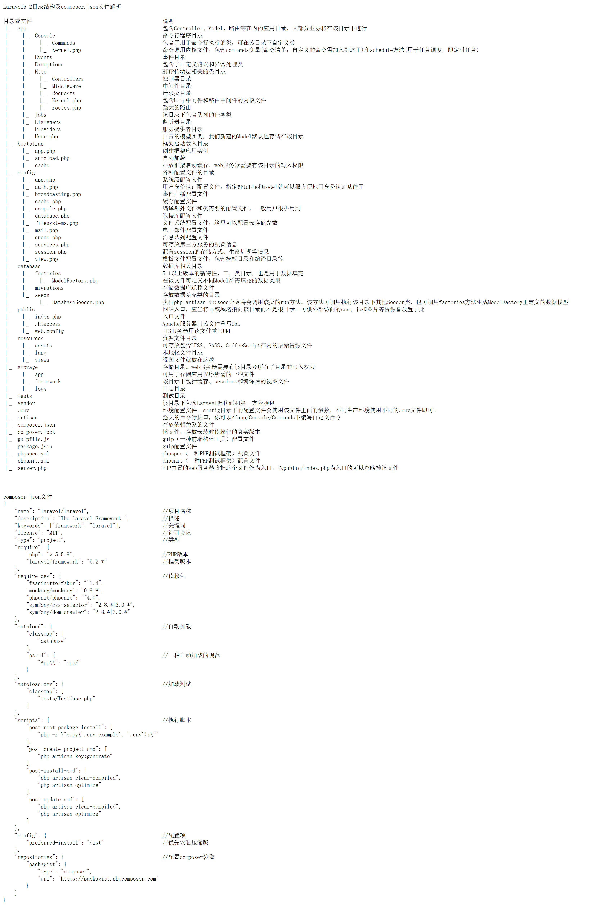
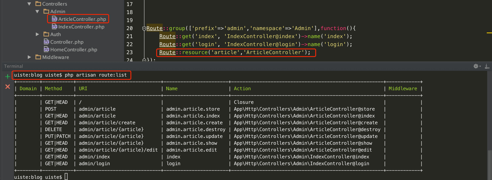

layout: post
title: Laravel 开发前奏
date: 2015-11-12 16:55:57
tags:
- Laravel
---
## 目录结构

## 配置选项
>php.ini
`extension=php_openssl.dll`
`extension=php_mbstring.dll`
`extension=php_pdo_mysql.dll`

## 修改默认首页
* server.php => index.php
* DirectoryIndex server.php
* 修改入口文件：`DocumentRoot ".../public"`
>需要服务器支持修改入口文件或者子目录可以绑定域名

将伪静态配置文件`.htaccess`移动到项目根目录

## 基础路由
• Route::get($uri, $callback);
• Route::post($uri, $callback);
• Route::put($uri, $callback);
• Route::patch($uri, $callback);
• Route::delete($uri, $callback);
• Route::options($uri, $callback);
• Route::match(['get', 'post'], '/', $callback);
• Route::any('foo', $callback);

### 参数限定

```
Route::get('user/{name}', function($name)
{
    //
})
->where('name', '[A-Za-z]+');

Route::get('user/{id}/{name}', function($id, $name)
{
    //
})
->where(['id' => '[0-9]+', 'name' => '[a-z]+'])
```
>postman插件
>路由参数不能使用`-`,需要使用`_`进行替换

## 基础控制器
laravel 控制器没有像ThinkPHP 那种参数访问控制器的方法，所有的控制器访问都需要通过路由进行设置

1. 手动创建路由与控制器相对繁琐
2. 使用Atrisan方法创建
```
uiste:blog uiste$ php artisan make:controller HomeController
Controller created successfully.
```

3. 控制器分文件夹
>命名空间
>路由使用 `\` 

## 高级路由
### 路由命名
```
Route::get('/index', ['as'=>'index',function(){
    echo route('index');
}]);
//简单的命名方法
---
http://www.blog.com/index
```

控制路由命名
`Route::get('/index', ['uses'=>'Admin\IndexController@index','as'=>'index']);`
`Route::get('/index', 'Admin\IndexController@index')->name('index');`
`return route('index');//控制器调用`

### 路由分组
将相同的路由放在一起，便于统一的管理
```
Route::get('admin/index', 'Admin\IndexController@index')->name('index');
Route::get('admin/login', 'Admin\IndexController@login')->name('login');
```

使用group对平台及命名空间进行分组方式如下：
```
Route::group(['prefix'=>'admin','namespace'=>'Admin'],function(){
    Route::get('index', 'IndexController@index')->name('index');
    Route::get('login', 'IndexController@login')->name('login');
});
```

Terminal中显示路由列表
`uiste:blog uiste$ php artisan route:list`

RESTfun 资源路由控制器
资源路由设置，优点：一条路由生成多种路由规则
`Route::resource('article','ArticleController');`



### Middleware中间件
HTTP 中间件提供一个方便的机制来过滤进入应用程序的 HTTP 请求。
Laravel 框架已经内置一些中间件，包括维护、身份验证、CSRF 保护，等等。所有的中间件都位于 app/Http/Middleware 目录内。

自定义路由中间件`app\Htp\Kernel.php`
1. kernel.php中定义中间件名
```
protected $routeMiddleware = [
	'admin.login' => \App\Http\Middleware\AdminLogin::class,
];
//后台登录中间件，AdminLogin中间件名
```

2. 使用Artisan创建中间件
`uiste:blog uiste$ php artisan make:middleware AdminLogin`

3. routes.php定义路由规则
```
Route::group(['middleware' => ['web','admin.login']], function () {
    Route::get('test',function(){
        echo 'test a middleware';
    });
});
```

4. 书写中间件条件
```
public function handle($request, Closure $next)
{
    if(session('admin'))
        return redirect('admin/login');
    return $next($request);
}
```

>使用`web`中间件，才能使用session

## 视图
方法一：``return view('greeting')->with('name', 'Victoria');``
>使用：$name; 可以多个with一同使用

方法二：``return = view('greeting', $data);``

方法三：``return view('greeting',compact('data','title'));``

## 模板引擎
blade模板引擎 基础用法
```
• {{ $name }}
• @{{ $name }} 					使用@符屏蔽语法解析
• {{ $name or 'Default' }} 		使用or设置默认值
• {{ isset($name) ? $name : 'Default' }}
• {!! $str !!} 					算感叹号代表htmlspecialchars_decode()
```

## Blade模板引擎 流程控制
有开始标志就要有结束标志
• @if
```
@if($data['score']<60)
    不及格
    @else
    及格
    @endif
```

• @unless       除非，用法同if
• @for
• @foreach 
```
@foreach($data['article'] as $v)
    {{ $v }}
    @endforeach
    }
```

• @forelse      是foreach的补充 
```
@forelse($data['article'] as $v)
    $v
    @empty
    没有数据
    @endforelse
```

• @while
以上基本流程控制可以嵌套

## Blade模板引擎 子视图
• @include(common.header)
• @include(common.name', ['some' => 'data'])
• @extends('layouts.master')
• @yield('content')
• @section('content') 
```
头文件
@section('content')
<p>父类模板文件中的内容</p>
@show
脚文件
```

子视图文件
```
@extends('layouts.home')
@section('content')
    @parent
    替换的内容
    @section('content')
```

## 读取配置项
`echo config('database.connections.mysql.prefix');`
`echo config('app.debug');`

## 连接数据库
```
$pdo = DB :: connection()->getPdo();
dd($pdo); //dd函数打印并终止程序继续运行
```

数据表操作
• DB::table('user')->get();
• DB::table('user')->where('user',1)->get();

## 模型创建
• php artisan make:model User
数据表操作
• protected $table="user";
• protected $primaryKey = 'user_id';
• public $timestamps = false;       //禁止默认时间戳
