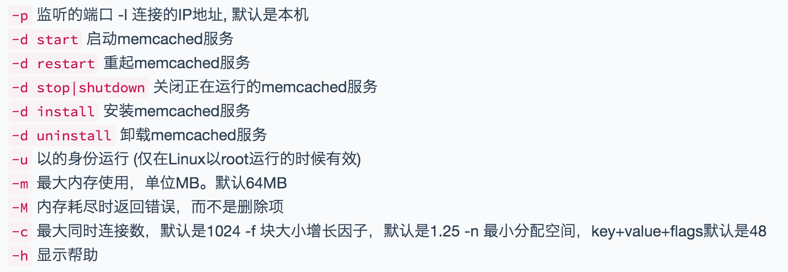
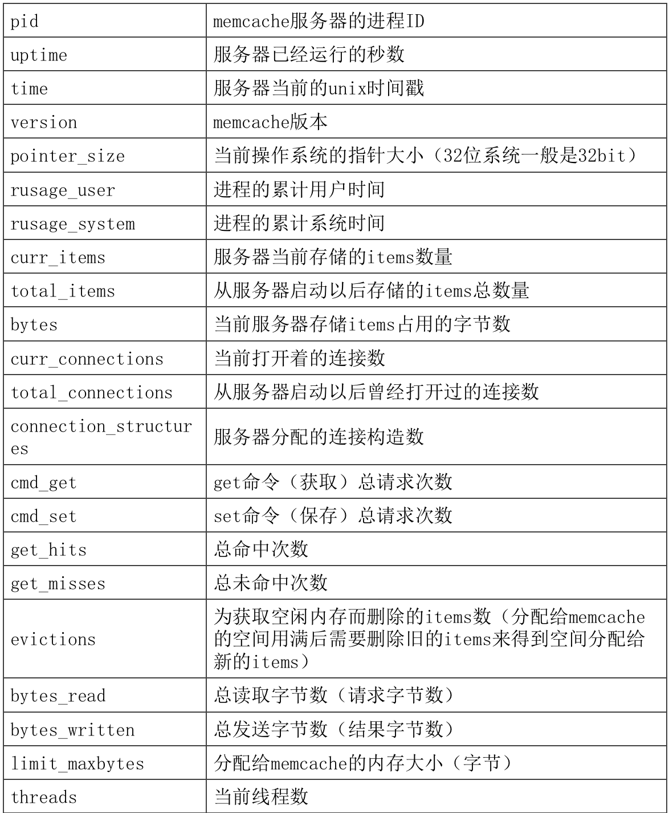

layout: post
title: 大型项目优化
date: 2015-11-16 01:45:06
tags:
- 服务器优化
- 数据库优化
---
## 问题与优化方案
#### 客户端与服务器之间的问题
描述：由于客户端跟服务器之间的网络不同，导致信号传输缓慢
解决：使用多线路服务器（运维处理）
#### Apache性能问题
描述：Apache在并发访问情况下，表现很一般
并发：在同一秒中有多少个用户在访问，一般来说并发达到100就特别到了
解决：使用负载均衡技术（服务器架构）
#### PHP引擎性能问题
描述：PHP代码整个解析效率根据引擎不一样，速度不一样
解决：1、代码优化	2、更换引擎
#### MySQL性能问题
描述：同样MySQL在并发请求比较高的情况下会故障，并发过高MySQL服务器会处于宕机状态。
工具：`bin/mysqlslap`压力测试工具
`mysqlslap.exe -a -c 10 -i 10 -uroot -p123456`
`mysqlslap.exe:Error when connecting to server:1040 Too many connections`
解决：由于mysql的并发请求特别高，解决该问题可以减少mysql的请求量。可以使用一个高速的存储系统储存数据，以后每次找存储系统获取数据。即使用memcache

## 优化具体方法
1. 网站开发中尽量使用较小的资源文件
2. 使用压缩技术（gzip压缩）
3. 使用cdn加速资源文件（负载均衡）
4. 使用缓存技术（内存缓存 redis/memcache/页面静态化）
5. 对数据库进行优化（索引、存储引擎、表规范、sql优化）
6. 网站架构重构采用分层模式设计，面向接口（API）编程
7. 使用负载均衡技术（请求分流）
8. 数据库使用读写分离或者分布式技术
9. 对相关软件配置进行优化
10. 硬件升级
11. 延迟加载

## 项目承载的并发量
单机+nginx+memcache+文件缓存+mysql数据库测试出的并发量：300
# Memcache
Memcache是一款基于**内存**的**键值对**的**缓存系统**，具备高速读写的特性，并且支持**分布式存储**
Memcached是一个高性能的分布式的内存对象缓存系统，使用这个缓存项目来构建大负载的网站，来分担数据库的压力，通过在内存里维护一个统一的巨大的hash表，它能够用来存储各种格式的数据，包括图像、视频、文件以及数据库检索的结果等。简单的说就是将数据调用到内存中，然后从内存中读取，从而大大提高读取速度。

## 概述
### 为什么内存中的数据读写速度快
#### 计算机数据运算流程
数据运算在CPU上进行的，cpu本身不能存储数据，cpu需要运算的数据来源于内存。内存本身可以存储部分数据，也可以从其他存储介质（磁盘）上读取数据
#### 设计机制
在磁盘上决定数据读写速度的是磁头定位查找数据。磁盘专属越高读写速度越快，对于MySQL优化，第一步可以将磁盘换成固态硬盘。内存是使用电流信号，所以速度特别快。

###缓存系统
只是临时存储数据的位置（非持久性数据），真实数据还是靠其他的存储介质保存。因为内存中的数据安全性不够，当由于异常服务器重启，内存中的数据会全部丢失。
### 分布式存储
将数据拆分到不同的Memcache服务器上存储。能够解决单台Memcache服务器存储的上线

## Memcache安装
### windows安装启动
#### 安装
方法一：一次性

方法二：加载到服务
`memcached.exe -d install memcached.exe -d start`
#### 启动
方法一：服务启动
方法二：`memcached.exe -d start`
方法三：`net start "memcached Server"`

#### 使用
Memcache是一个基于tcp协议的第三方应用。可以使用Telnet工具操作Memcache
1. 开启Telnet客户端
控制面板->程序功能->启用或关闭windows功能->勾选Telnet

2. 使用Telnet客户端
连接方式：进入cmd执行telent   ip地址  端口号
### Linux安装

`[root@localhost libevent-2.0.20-stable]# make && make install`

2.
```
[root@localhost libevent-2.0.20-stable]# cd ../
[root@localhost memcache]# tar -zxvf memcached-1.4.20.tar.gz
[root@localhost memcached-1.4.20]# ./configure --prefix=/usr/local/memcache --with-libevent=/usr/local/bibevent
[root@localhost memcached-1.4.20]# make && make install
```

#### 常用命令

**memcache的基本命令**



#### 权限问题
在Memcache中没有账号密码，因此Memcache中的数据不太安全。
解决办法：
1. 将Memcache服务器置于内网中，然后使用反向代理技术访问
2. 通过服务器防火墙的配置，只允许某个IP地址可以访问
在Linux可以使用hosts.allow跟hosts.deny文件控制访问权限，也叫黑白名单

```
[root@localhost ~]# cd /etc/host
host.conf hosts hosts.allow hosts.deny
[root@localhost ~]# cd /etc/host.allow
```

### 常用操作命令
#### 设置数据 | set
语法：
```
set keyname(键名) 0|1 (数据是否压缩处理) exprie(有效时间) length(字符长度)
Value(具体的数据)
```

如果数据已经存在则修改数据
>写入具体的value数据时有回车换行操作
>对于键名的操作一般不操作250字节
>一般情况数据不压缩，压缩会将数据的体积变小，但读取数据时需要进行解压操作，因此整个效率降低了（时间 <==> 空间）
>有效时间：针对Memcache中每一个键，都可以设置一个过期时间，如果时间一到，该键数据会消失，时间采用的是秒为单位，即多少秒之后过期，0表示永不过期
#### 获取数据 | get
配合set使用

#### 添加数据 | add
语法：`add key 0|1 失效时间  值的长度 `
>注意：在使用add时，如果键已经存在，则添加失败。

#### 删除数据 | delete
语法：`delete key`
#### 删除所有 | flush_all
语法：flush_all
>项目中慎用该命令
#### 加法操作 | incr
语法：`incr key number`
>对数据向下取整
#### 减法操作 | decr
语法：`decr key number`
>使用decr就可以模拟秒杀系统，比如一开始设置值为100 有效期为60秒

#### 状态操作 | stats
通过查看stats主要计算命中率
`命中率 = get_hits/cmd_get`  自然是命中率越高越好，如果命中率很低，则说明缓存效率低，需要调整缓存的数据内容，一般项目命中率能够到70%-90%就算很好。如果内存不够用，先删除快过期的，再删除不常用的，由系统底层监控


## PHP操作Memcache
### 安装扩展
通过phpinfo查看php.ini所在位置，PHP的版本号，及Thread Safety。
>根据以上信息选择对应版本，Enable 选择使用ts版本。否则使用nts版本，

在php.ini中通过`extension_dir`查看扩展包所在路径
>将php_memcache.dll文件拷贝到扩展目录下
>修改php.ini加入配置项：`extension = php_memcache.dll`

重启Apache，查看phpinfo() ，是否包含Memcache扩展模块

### 使用Memcache
1. 实例化memcache对象
`$mem = new Memcache();`
2. 与memcache服务器建立连接
`$mem->connect('27.0.0.1',11211);`
3. 向memcache中写入数据
`$mem->set('name','uiste');`
4. 查询数据
`$res = $mem->get('name');`

### 存储原理
Memcache可以正常存储PHP的标量类型、符合类型、空类型，但不能存储资源类型。在Memcache中本身存储的是字符串，Memcache类的set方法在向Memcache写入数据时会先将数据序列化，在get获取数据后然后反序列化。

## 应用场景
1. session写入Memcache中
2. 作为分布式存储系统
3. 作为缓存系统使用
