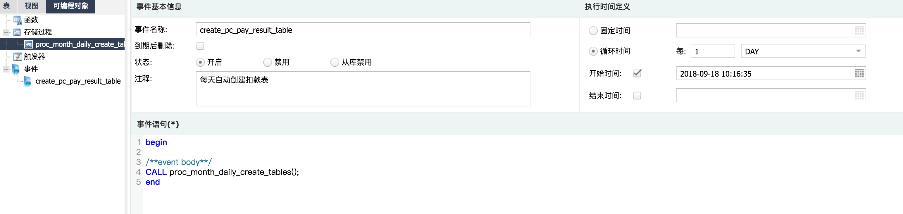

# 存储过程自动分表
```
# 参照表
CREATE TABLE `pc_pay_result_20170420` (
  `id` int(11) unsigned NOT NULL AUTO_INCREMENT,
  `order_id` varchar(32) NOT NULL
) ENGINE=InnoDB DEFAULT CHARSET=utf8 COMMENT='支付结果';

# 存储过程
DROP PROCEDURE IF EXISTS `proc_month_daily_create_tables`;
DELIMITER $$
CREATE PROCEDURE `proc_month_daily_create_tables`() 
begin  
set @current_20_tablesql=(select concat('es.pc_pay_result_',date_format(curdate(),'%Y%m'),'20'));
set @create_tablesql_00=(select concat('CREATE TABLE IF NOT EXISTS es.pc_pay_result_',date_format(date_add(curdate(),interval 1 month),'%Y%m'),'00 like ','es.pc_pay_result_',date_format(curdate(),'%Y%m'),'20;'));
set @create_tablesql_10=(select concat('CREATE TABLE IF NOT EXISTS es.pc_pay_result_',date_format(date_add(curdate(),interval 1 month),'%Y%m'),'10 like ','es.pc_pay_result_',date_format(curdate(),'%Y%m'),'20;'));
set @create_tablesql_20=(select concat('CREATE TABLE IF NOT EXISTS es.pc_pay_result_',date_format(date_add(curdate(),interval 1 month),'%Y%m'),'20 like ','es.pc_pay_result_',date_format(curdate(),'%Y%m'),'20;'));

PREPARE create_tablesql_00 FROM @create_tablesql_00;     
EXECUTE create_tablesql_00;  
PREPARE create_tablesql_10 FROM @create_tablesql_10;     
EXECUTE create_tablesql_10;  
PREPARE create_tablesql_20 FROM @create_tablesql_20;     
EXECUTE create_tablesql_20;  

END 
$$
DELIMITER ;

# 自动创建事件
CREATE DEFINER=`root`@`localhost` EVENT `存储过程建表事件` ON SCHEDULE EVERY '0:1' MINUTE_SECOND STARTS '2019-04-07 15:38:29' ON COMPLETION NOT PRESERVE ENABLE COMMENT '存储过程建表' DO begin
/**event body**/
CALL proc_month_daily_create_tables();
end

CREATE DEFINER=`root`@`localhost` EVENT `存储过程建表事件` ON SCHEDULE EVERY '0 1' DAY_HOUR STARTS '2019-04-08 15:38:29' ON COMPLETION NOT PRESERVE ENABLE COMMENT '存储过程建表' DO begin
/**event body**/
CALL proc_month_daily_create_tables();
end 
```




# 创建自定义函数


