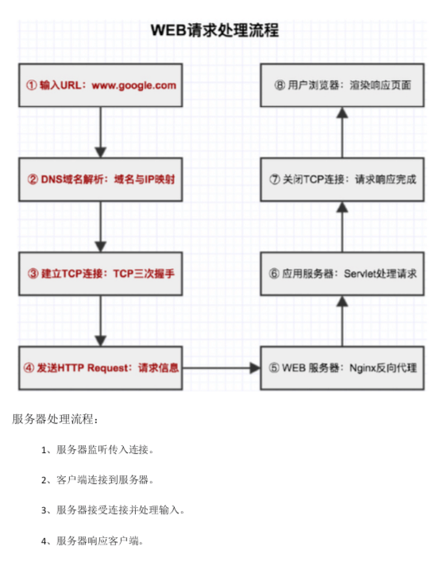
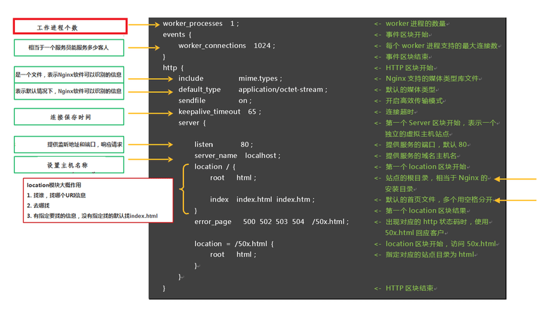

[官方文档参考1](https://wizardforcel.gitbooks.io/nginx-doc/content/Text/1.3_install.html)
[Tengine文档参考2](https://tengine.taobao.org/nginx_docs/cn/docs/)
## 概念
正向代理
>代购、翻墙工具。特点客户端非常明确要访问的服务器地址，服务器只清楚请求来自哪个代理服务器，而不请求具体的客户端。

方向代理
>负载均衡、分布式部署。特点按照一定的规则分发给后盾业务处理服务器。来源是客户端请求去哪里由代理服务器根据规则决定。


## NGINX特性：
1. 更快
2. 高扩展性（HTTP核心模块、events模块、log模块）
3. 高可靠性（进程相对独立，master在起个worker进程出错时可以快速拉起新的worker子进行提供服务）
4. 低内存消耗（1w个非活跃的HTTP keep-alive 连接 在NGINX中消耗2.5MB的内存）
5. 单机支持10万以上的并发连接
6. 热部署（master与worker进程的分离设计）
7. 最自由的bsd许可协议

## web请求处理流程


## nginx高效的原因
1. 多进程方式

## TCP 和 UDP
>UDP和TCP最大的区别，UDP不可靠，只管发送不管是否接受到

## 多进程
pcntl扩展是PHP在Linux环境下进程控制的重要扩展，WorkerMan用到了其进程创建、信号控制、定时器、进程状态监控等特性。此扩展win平台不支持。
```
for ($i=0;$i<3;$i++){
    $pid=pcntl_fork();  //创建子进程
    //父进程和子进程都会执行下面代码
    if ($pid == -1) {
        //错误处理：创建子进程失败时返回-1.
        die('could not fork');
    } else if ($pid) {
        //父进程会得到子进程号，所以这里是父进程执行的逻辑
        var_dump('父进程',$pid);
        pcntl_wait($status); //等待子进程中断，防止子进程成为僵尸进程。
    } else {
        //子进程得到的$pid为0, 所以这里是子进程执行的逻辑。
        sleep(5);
        var_dump('子进程',$pid);
    }
}
```

安装pcntl模块
```
http://cn2.php.net/distributions/php-7.1.14.tar.xz
tar xf php-7.1.14.tar.xz
cd php-7.1.14
cd ext/pcntl
phpize
./configure --with-php-config=/usr/bin/php-config
make
make install
echo "extension=pcntl.so" >> /etc/php.ini
```

## IO多路复用
就是通过一种机制，一个进程可以监视多个描述符（socket），一旦某个描述符就绪，能够通知程序执行相应的读写操作。
epoll是在2.6内核中提出的。是之前select和poll的增强版。select、poll问题就是需要循环检测连接是否有事件。没有描述符限制，无需轮询。epoll使用一个文件描述符管理多个描述符，当连接有I/O流时间产生的时候，epoll就会告诉警察连接有I/O流事件产生，然后警察就去处理这个进程。
NGINX就是基于epoll的异步非阻塞的服务器程序。自然，nginx能够轻松处理百万级的并发连接。

安装libevent依赖:
```
官网：http://www.monkey.org/~provos/libevent/
下载：http://www.monkey.org/~provos/libevent-2.0.10-stable.tar.gz
tar zxvf libevent-2.0.10-stable.tar.gz
cd libevent-2.0.10-stable
    ./configure  –prefix=/usr   //安装路径设置
make
make install

测试libevent是否安装成功：
    ls -al /usr/lib | grep libevent
```

安装event扩展:
```
    cd /usr/local/src
   wget http://pecl.php.net/get/event-2.3.0.tgz

    tar -zxvf event-2.3.0.tgz && cd event-2.3.0

    /usr/local/php/bin/phpize

    ./configure  --with-event-libevent-dir=/usr/local/libevent-2.1.8-stable/    

注意 --with-event-libevent-dir   libevent的安装目录
    make && make install	
在/usr/local/php/etc/ 目录下，复制php.ini 为php-cli.ini 添加下面配置	
extension=event.so

```

## 进程工作内容
### master进程

1. Nginx启动后，会产生一个主进程，主进程执行一系列的工作后会产生一个或者多个工作进程

2. 在客户端请求动态站点的过程中，Nginx服务器还涉及和后端服务器的通信。Nginx将接收到的Web请求通过代理转发到后端服务器，由后端服务器进行数据处理和组织；

3. Nginx为了提高对请求的响应效率，降低网络压力，采用了缓存机制，将历史应答数据缓存到本地。保障对缓存文件的快速访问

master进程主要用来管理worker进程，具体包括以下主要功能：

（1）接收来自外界的信号。
（2）处理配置文件读取。
（3）创建，绑定和关闭套接字
（4）启动，终止和维护配置的工作(worker)进程数
（5）当woker进程退出后（异常情况下），会自动重新启动新的woker进程。


### worker进程
worker进程的主要任务是完成具体的任务逻辑。其主要关注点是与客户端或后端真实服务器（此时nginx作为中间代理）之间的数据可读/可写等I/O交互事件。
（1）接收客户端请求；
（2）将请求一次送入各个功能模块进行过滤处理；
（3）与后端服务器通信，接收后端服务器处理结果；
（4）数据缓存
（5）响应客户端请求

## nginx 编译安装
```
yum -y install   pcre pcre-devel zlib zlib-devel openssl  openssl-devel

wget  http://nginx.org/download/nginx-1.14.1.tar.gz

tar -zxvf nginx-1.14.1.tar.gz

cd nginx-1.14.1

./configure --prefix=/usr/local/nginx --with-http_stub_status_module --with-http_gzip_static_module --with-http_realip_module --with-http_sub_module --with-http_ssl_module --with-http_realip_module --with-http_sub_module --with-http_gunzip_module --with-http_gzip_static_module --with-http_auth_request_module --with-http_random_index_module --with-http_slice_module --with-http_stub_status_module 

make && make install


test -d '/usr/local/nginx' || mkdir -p '/usr/local/nginx'
test -d '/usr/local/nginx/sbin' \
	|| mkdir -p '/usr/local/nginx/sbin'
test ! -f '/usr/local/nginx/sbin/nginx' \
	|| mv '/usr/local/nginx/sbin/nginx' \
		'/usr/local/nginx/sbin/nginx.old'
cp objs/nginx '/usr/local/nginx/sbin/nginx'
test -d '/usr/local/nginx/conf' \
	|| mkdir -p '/usr/local/nginx/conf'
cp conf/koi-win '/usr/local/nginx/conf'
cp conf/koi-utf '/usr/local/nginx/conf'
cp conf/win-utf '/usr/local/nginx/conf'
test -f '/usr/local/nginx/conf/mime.types' \
	|| cp conf/mime.types '/usr/local/nginx/conf'
cp conf/mime.types '/usr/local/nginx/conf/mime.types.default'
test -f '/usr/local/nginx/conf/fastcgi_params' \
	|| cp conf/fastcgi_params '/usr/local/nginx/conf'
cp conf/fastcgi_params \
	'/usr/local/nginx/conf/fastcgi_params.default'
test -f '/usr/local/nginx/conf/fastcgi.conf' \
	|| cp conf/fastcgi.conf '/usr/local/nginx/conf'
cp conf/fastcgi.conf '/usr/local/nginx/conf/fastcgi.conf.default'
test -f '/usr/local/nginx/conf/uwsgi_params' \
	|| cp conf/uwsgi_params '/usr/local/nginx/conf'
cp conf/uwsgi_params \
	'/usr/local/nginx/conf/uwsgi_params.default'
test -f '/usr/local/nginx/conf/scgi_params' \
	|| cp conf/scgi_params '/usr/local/nginx/conf'
cp conf/scgi_params \
	'/usr/local/nginx/conf/scgi_params.default'
test -f '/usr/local/nginx/conf/nginx.conf' \
	|| cp conf/nginx.conf '/usr/local/nginx/conf/nginx.conf'
cp conf/nginx.conf '/usr/local/nginx/conf/nginx.conf.default'
test -d '/usr/local/nginx/logs' \
	|| mkdir -p '/usr/local/nginx/logs'
test -d '/usr/local/nginx/logs' \
	|| mkdir -p '/usr/local/nginx/logs'
test -d '/usr/local/nginx/html' \
	|| cp -R html '/usr/local/nginx'
test -d '/usr/local/nginx/logs' \
	|| mkdir -p '/usr/local/nginx/logs'
make[1]: Leaving directory `/root/nginx-1.14.1'
```

```
ln -s /usr/local/nginx/sbin/nginx /usr/bin/nginx
启动：
nginx -c /usr/local/nginx/conf/nginx.conf
```



## nginx常用命令
1、查看Nginx的版本号：nginx  -V
2、停止 nginx -s stop
3、退出 nginx -s quit
4、重启加载配置 nginx -s reload
5、配置文件启动 nginx  -c </path/to/config> 为 Nginx 指定一个配置文件，来代替缺省的
6、nginx  -t 不运行，而仅仅测试配置文件。nginx 将检查配置文件的语法的正确性，并尝试打开配置文件中所引用到的文件。

## 配置
配置块: location
```
语法： location[=|~|~*|^~|@]/uri/{...}
配置块： server
location会尝试根据用户请求中的URI来匹配上面的/uri表达式，如果可以匹配，就选择
location{}块中的配置来处理用户请求。当然，匹配方式是多样的，下面介绍location的匹配
规则。

location表达式类型
~ 表示执行一个正则匹配，区分大小写；
~* 表示执行一个正则匹配，不区分大小写；
^~ 表示普通字符匹配。使用前缀匹配。如果匹配成功，则不再匹配其他location；
= 进行普通字符精确匹配。也就是完全匹配；
@ 它定义一个命名的 location，使用在内部定向时，例如 error_page, try_files

优先级：
等号类型（=）的优先级最高。一旦匹配成功，则不再查找其他匹配项
前缀普通匹配(^~)优先级次之。不支持正则表达式。使用前缀匹配，如果有多个location匹配的话，则使用表达式最长的那个
正则表达式类型（~ ~*）的优先级次之。一旦匹配成功，则不再查找其他匹配项
常规字符串匹配，如果有多个location匹配的话，则使用表达式最长的那个

(location =) > (location 完整路径) > (location ^~ 路径) > (location ~,~* 正则顺序) > (location 部分起始路径) 
```

访问控制模块
```
用来对特定IP的进行访问控制
默认是允许所有ip访问，若部分允许需定义deny all
allow
语法:   allow address | CIDR | unix: | all;
默认值:     —
区块: http, server, location, limit_except
允许某个ip或者一个ip段访问

deny
语法:     deny address | CIDR | unix: | all;
默认值:     —
区块:     http, server, location, limit_except

allow、deny实例
location / {
deny  192.168.1.1;
allow 192.168.1.0/24;
allow 47.98.147.49;
deny  all;

}
 		  
 	
比如可以限制某些目录下的某些文件的访问，具体可以自己组合

禁止访问所有目录下的sql|log|txt|jar|sh|py后缀的文件，

location ~.*\.(sql|log|txt|jar|war|sh|py|php) {
     deny all;
}
```

## if模块
```
if指令
语法：if(condition){…}
区块：server，location
该指令用于检查一个条件是否符合，如果条件符合，则执行大括号内的语句。if指令不支持嵌套，不支持多个条件&&和||处理。
其中，condition中可以包含的判断标识如下
~为区分大小写匹配
~*为不区分大小写匹配
-f和!-f用来判断是否存在文件
-d和!-d用来判断是否存在目录
-e和!-e用来判断是否存在文件或目录
-x和!-x用来判断文件是否可执行
```

## 特点
>IO多路复用epoll
>模块化轻量化
>CPU亲和（CPU核心worker进程绑定分配）
```
# 几个物理CPU
cat /proc/cpuinfo|grep "physical id" | sort | uniq | wc | -l

# 几个核心
cat /proc/cpuinfo|grep "cpu cores" | uniq 
```

## 中间件架构
1. 静态资源web服务
2. 代理服务
3. 负载均衡调度器
4. 动态缓存
>proxy_cache


## 动态负载均衡
nginx-upsync-module提供了动态的负载均衡，动态更新上游的服务器不需要reload nginx，它的功能是拉取 consul 的后端 server 的列表，并更新 Nginx 的路由信息。此模块不依赖于任何第三方模块。 consul 作为 Nginx 的 db，利用 consul 的 KV 服务，每个 Nginx work 进程独立的去拉取各个 upstream 的配置，并更新各自的路由。

```
wget  https://github.com/weibocom/nginx-upsync-module/archive/v2.1.0.tar.gz

--add-module=/root/nginx-upsync-module-2.1.0

      示例：
upstream swoole_test {
        upsync  127.0.0.1:8700/v1/kv/upstreams/swoole_test upsync_timeout=6m upsync_interval=500ms  upsync_type=consul  strong_dependency=off;
        upsync_dump_path /usr/local/nginx/conf/servers_test.conf;
        include /usr/local/nginx/conf/servers_test.conf;
    }
```

upsync模块会去consul拉取最新的upstream信息并存到本地的文件中
upsync_timeout 配置从consul拉取上游服务器的超时时间
upsync_interval 配置从consul拉取上游服务器的间隔时间
upsync_type 指定使用配置服务器的类型，当前是consul
strong_dependency 启动时是否强制依赖配置服务器，如果配置为on,则拉取失败，nginx同样会启用失败

upsync_dump_path 指定从consul拉取的上游服务器后持久化到的位置，这样即使
Consul服务器出问题了，本地同样会有备份


添加的时候要注意名称模块的匹配：


2、安装consul
 对于consul的介绍可以移步到另外的文档，暂时先了解就行，我们可以先通过docker的方式pull一个consul
```

    curl -X PUT -d '{"weight":1, "max_fails":2, "fail_timeout":10}' http://$consul_ip:$port/v1/kv/$dir1/$upstream_name/$backend_ip:$backend_port


   curl -X PUT -d '{"weight":1,"max_fails":2,"fail_timeout":10}' http://127.0.0.1:8700/v1/kv/upstreams/swoole_test/127.0.0.1:9501
```

查看所有已经存储的k/v
```
curl  http://127.0.0.1:8700/v1/kv/?recurse
```

删除
```
  curl  -X  DELETE  http://127.0.0.1:8700/v1/kv/upstreams/swoole_test/127.0.0.1:9501
```


